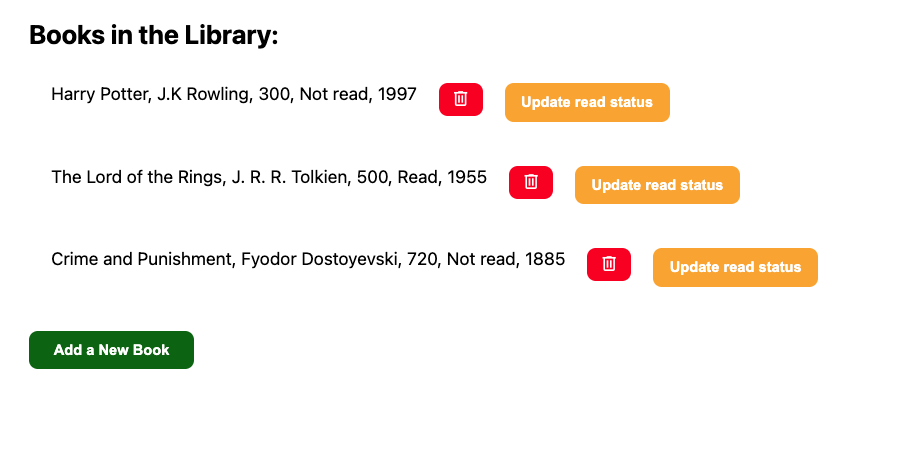
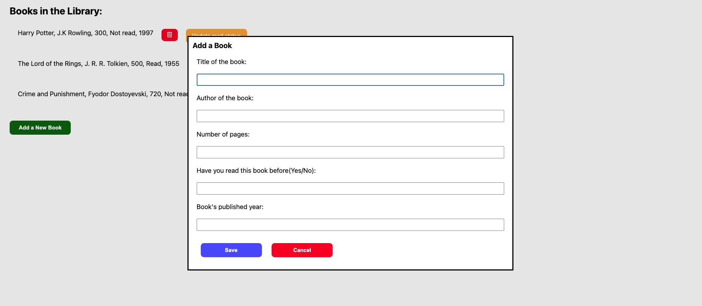

# Library

A browser-based library app built with vanilla JavaScript as part of The Odin Project JavaScript curriculum.

## Preview

## Features

- Store books in an array with unique IDs generated via `crypto.randomUUID()`
- Add new books via a modal dialog (title, author, pages, read status, publication year)
- Display all books dynamically on the page
- Remove individual books from the library
- Toggle read/not read status for each book

## Built With

- HTML
- CSS
- JavaScript (Constructor functions, Prototype methods, DOM manipulation)

## Live Demo

[https://arifmertmisir.github.io/library]

## Project Spec

[The Odin Project – Library](https://www.theodinproject.com/lessons/node-path-javascript-library)
